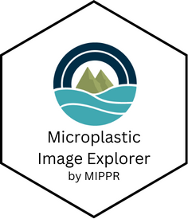

# Microplastic Image Explorer Tool 

)

# Description

Welcome to the Microplastic Image Explorer webpage. This tool was designed to allow users to improve their use of visual microscopy in microplastic identification. Start by querying the database of microplastic images by citation, color, morphology, polymer, and/or size.

# Installation

- Use the web app: [openanalysis.org/image_explorer](https://moore-institute-4-plastic-pollution-res.github.io/microplastic_image_explorerWebR/)

- The code for the app is in [app.R](https://github.com/Moore-Institute-4-Plastic-Pollution-Res/microplastic_image_explorerWebR/blob/main/app.R) 

# Additional Information

- A tutorial video is available [here](https://youtu.be/H63MT6Gplkg)
